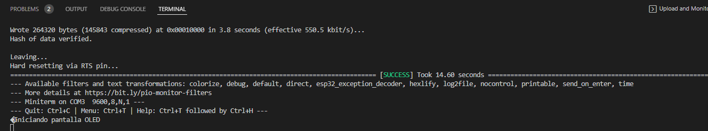
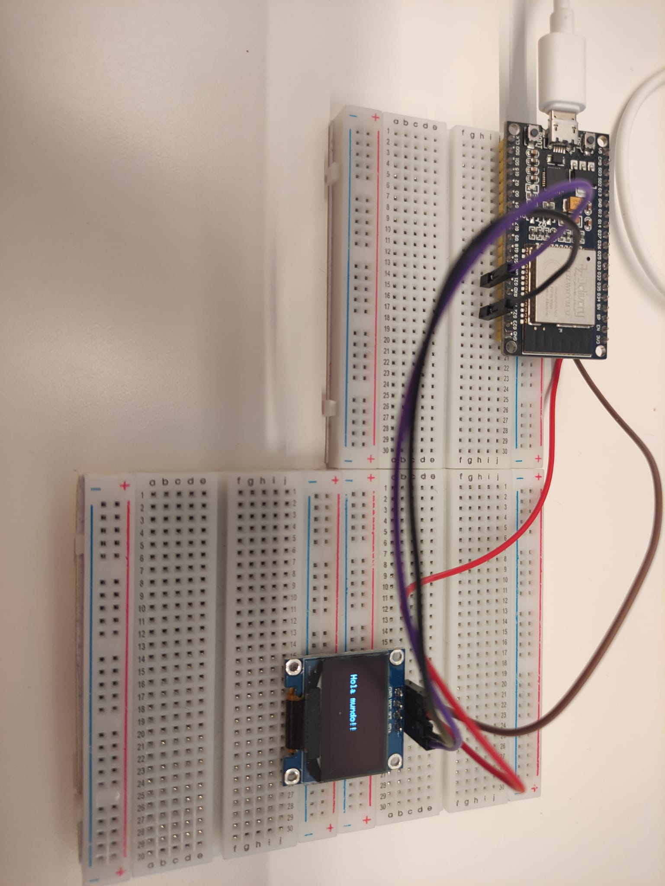

# PRACTICA 5  : Buses de comunicación I (introducción y I2c)

## B: MOSTRAR TEXTO POR PANTALLA OLED

### Código

```cpp
#define __DEBUG__

#include <SPI.h>
#include <Wire.h>
#include <Adafruit_GFX.h>
#include <Adafruit_SSD1306.h>

// Definir constantes
#define ANCHO_PANTALLA 128 // ancho pantalla OLED
#define ALTO_PANTALLA 64 // alto pantalla OLED

// Objeto de la clase Adafruit_SSD1306
Adafruit_SSD1306 display(ANCHO_PANTALLA, ALTO_PANTALLA, &Wire, -1);

void setup() {
#ifdef __DEBUG__
  Serial.begin(9600);
  delay(100);
  Serial.println("Iniciando pantalla OLED");
#endif

  // Iniciar pantalla OLED en la dirección 0x3C
  if (!display.begin(SSD1306_SWITCHCAPVCC, 0x3C)) {
#ifdef __DEBUG__
    Serial.println("No se encuentra la pantalla OLED");
#endif
    while (true);
  }

  // Limpiar buffer
  display.clearDisplay();

  // Tamaño del texto
  display.setTextSize(1);
  // Color del texto
  display.setTextColor(SSD1306_WHITE);
  // Posición del texto
  display.setCursor(10, 32);
  // Escribir texto
  display.println("Hola mundo!!");

  // Enviar a pantalla
  display.display();

}

void loop() {}
```

### Funcionamiento del programa

En primer lugar, haremos uso de cuatro librerias que serán totalmente necesarias. También tendremos que declarar dos variables, una para la altura de nuestro display y otra para el ancho del display. Posteriormente crearemos una clase con ambas variables.

```cpp
#include <SPI.h>
#include <Wire.h>
#include <Adafruit_GFX.h>
#include <Adafruit_SSD1306.h>

// Definir constantes
#define ANCHO_PANTALLA 128 // ancho pantalla OLED
#define ALTO_PANTALLA 64 // alto pantalla OLED
 
// Objeto de la clase Adafruit_SSD1306
Adafruit_SSD1306 display(ANCHO_PANTALLA, ALTO_PANTALLA, &Wire, -1);
```

A continuación definimos nuestra función Setup, en primer lugar iniciaremos el puerto série y el propio display con la función "display.begin(SSD1306_SWITCHCAPVCC, 0x3C)". En este punto si la función retorna false, significa que no ha encontrado ningún display y por tanto nos da un error.

Finlmente la función Setup se encargara de describir que vamos a mostrar por pantalla, en este caso será "Hola mundo!".

```cpp
void setup() {
#ifdef __DEBUG__
  Serial.begin(9600);
  delay(100);
  Serial.println("Iniciando pantalla OLED");
#endif

  // Iniciar pantalla OLED en la dirección 0x3C
  if (!display.begin(SSD1306_SWITCHCAPVCC, 0x3C)) {
#ifdef __DEBUG__
    Serial.println("No se encuentra la pantalla OLED");
#endif
    while (true);
  }

  // Limpiar buffer
  display.clearDisplay();

  // Tamaño del texto
  display.setTextSize(1);
  // Color del texto
  display.setTextColor(SSD1306_WHITE);
  // Posición del texto
  display.setCursor(10, 32);
  // Escribir texto
  display.println("Hola mundo!");

  // Enviar a pantalla
  display.display();

}
```

### Fotos del Montaje






